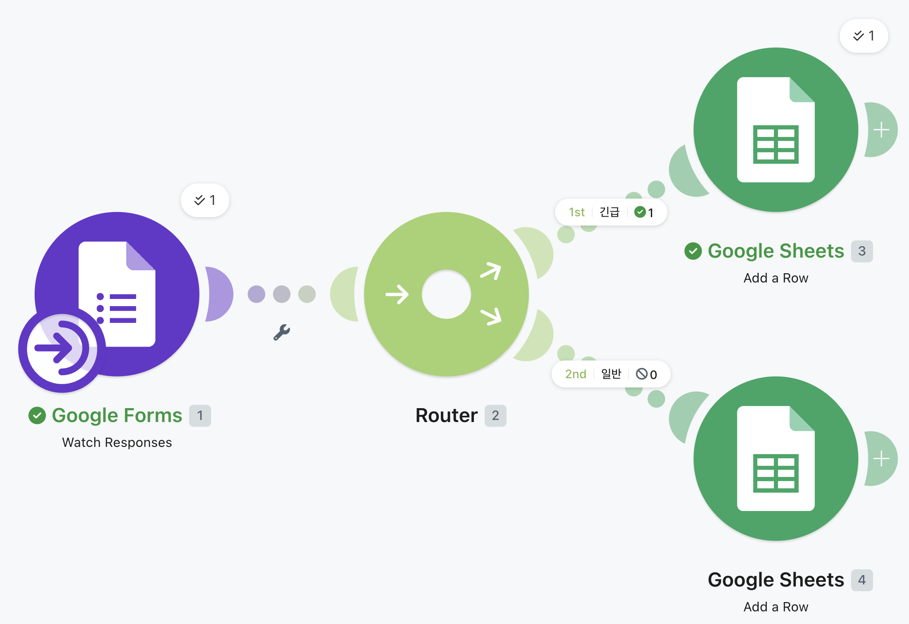
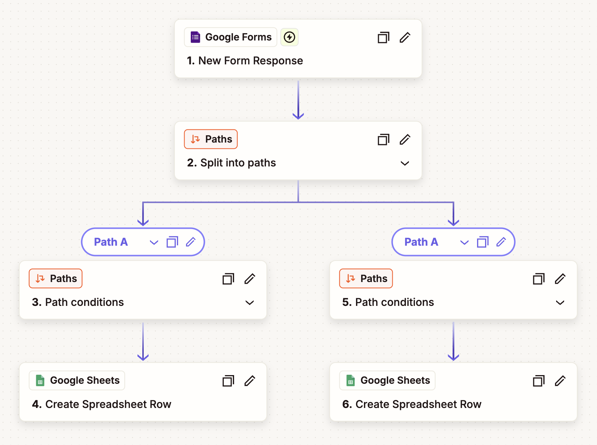

# 프로젝트 1: 자동화 도구 비교 구현 보고서

## 1. 프로젝트 개요

### 1.1 주제
Google Form 응답 접수 → 조건 분기(문의 유형별) → Google Sheets 분류 저장 + 이메일 알림 자동화

### 1.2 목적
동일한 워크플로우를 Make와 Zapier로 각각 구현하고, 두 도구의 특징과 장단점을 비교 분석한다.

### 1.3 사용 도구
| 구분 | 도구 | 플랜 |
|------|------|------|
| 도구 A | Make | Free |
| 도구 B | Zapier | Free |

### 1.4 연동 서비스
- Google Forms (Trigger)
- Google Sheets (Action - 데이터 저장)
- Gmail (Action - 알림 발송)

---

## 2. 워크플로우 설계

### 2.1 전체 흐름도
```
[Trigger] Google Form 새 응답 제출
│
▼
[조건 분기] "문의 유형" 필드 값 확인
│
├── 유형 = "긴급 문의"
│ ├── [Action 1] Google Sheets "긴급" 시트에 행 추가
│ └── [Action 2] Gmail로 긴급 알림 이메일 발송
│
└── 유형 = "일반 문의"
├── [Action 1] Google Sheets "일반" 시트에 행 추가
└── [Action 2] Gmail로 접수 확인 이메일 발송
```

### 2.2 Google Form 구성

| 필드명 | 입력 유형 | 설명 |
|--------|-----------|------|
| 문의 유형 | 드롭다운 | "긴급" / "일반" |
| 문의 내용 | 장문형 | 문의 상세 내용 |

> **[스크린샷 #1]** Google Sheets 시트 탭 구성 ("긴급" 시트, "일반" 시트)
>
> 

---

## 3. Make 구현

### 3.1 시나리오 구성

#### Trigger 설정
- **모듈**: Google Forms → Watch Responses
- **연결**: Google 계정 OAuth 인증
- **대상 폼**: "고객 문의 접수 폼"

#### Router (조건 분기) 설정
- **분기 조건 1**: 문의 유형 = "긴급 문의"
- **분기 조건 2**: 문의 유형 = "일반 문의"

#### Action 설정

**분기 1 - 긴급 문의 경로:**

| 순서 | 모듈 | 설정 내용 |
|------|------|-----------|
| 1 | Google Sheets → Add a Row | "긴급" 시트에 이름, 이메일, 문의 내용, 접수 시간 저장 |
**분기 2 - 일반 문의 경로:**

| 순서 | 모듈 | 설정 내용 |
|------|------|-----------|
| 1 | Google Sheets → Add a Row | "일반" 시트에 이름, 이메일, 문의 내용, 접수 시간 저장 |

> **[스크린샷 #2]** Make - 전체 시나리오 구성
>
> 

---

## 4. Zapier 구현

### 4.1 Zap 구성

#### Trigger 설정
- **앱**: Google Forms
- **이벤트**: New Form Response
- **대상 폼**: "고객 문의 접수 폼" (Make와 동일한 폼 사용)

#### Paths (조건 분기) 설정
- **Path A**: 문의 유형 = "긴급 문의"
- **Path B**: 문의 유형 = "일반 문의"

#### Action 설정

**Path A - 긴급 문의 경로:**

| 순서 | 앱/이벤트 | 설정 내용 |
|------|-----------|-----------|
| 1 | Google Sheets → Create Spreadsheet Row | "긴급" 시트에 행 추가 |

**Path B - 일반 문의 경로:**

| 순서 | 앱/이벤트 | 설정 내용 |
|------|-----------|-----------|
| 1 | Google Sheets → Create Spreadsheet Row | "일반" 시트에 행 추가 |

> **[스크린샷 #3]** Zapier - 전체 Zap 구성
>
> 

---

## 5. 비교 분석

### 5.1 비교 항목 상세

#### 1) UI/UX

| 항목 | Make | Zapier |
|------|------|--------|
| 인터페이스 방식 | 시각적 노드(캔버스) 기반 | 리스트(단계별 목록) 기반 |
| 워크플로우 가독성 | 전체 흐름이 한눈에 보임 | 단계를 하나씩 펼쳐서 확인 |
| 초보자 친화도 | 중간 (자유도가 높아 처음엔 복잡하게 느껴질 수 있음) | 높음 (위→아래 순서대로 따라가면 됨) |
| 드래그 앤 드롭 | 캔버스 위에서 자유롭게 배치 가능 | 지원하지 않음 (순서 고정) |

**요약**: Make는 복잡한 분기 흐름을 시각적으로 파악하기 좋고, Zapier는 단순한 흐름을 빠르게 만들기 좋다.

#### 2) 설정 난이도

| 항목 | Make | Zapier |
|------|------|--------|
| 계정 연동 | OAuth 팝업으로 연결 (간편) | OAuth 팝업으로 연결 (간편) |
| Trigger 설정 | 모듈 검색 → 폼 선택 → 저장 | 앱 선택 → 이벤트 선택 → 폼 선택 |
| 조건 분기 설정 | Router 모듈 추가 → 각 경로에 Filter 조건 입력 | Paths 단계 추가 → 각 Path에 조건 입력 |
| 필드 매핑 | 이전 모듈 출력값을 클릭해서 매핑 | 드롭다운에서 이전 단계 필드 선택 |
| 전체 소요 시간 (체감) | 약 20~30분 | 약 15~20분 |

**요약**: Zapier가 단계별 가이드 형식이라 초보자에게 더 쉽다. Make는 자유도가 높은 대신 처음 익히는 데 시간이 조금 더 걸린다.

#### 3) 무료 플랜 범위

| 항목 | Make (Free) | Zapier (Free) |
|------|-------------|---------------|
| 월 실행 횟수 | 1,000 Operations | 100 Tasks |
| 활성 시나리오/Zap 수 | 2개 | 5개 |
| 조건 분기 사용 | ✅ 무료에서 가능 | ⚠️ Paths는 유료 플랜 전용 (Multi-Step Zap) |
| 실행 간격 (최소) | 15분 | 15분 |
| HTTP/Webhook 모듈 | ✅ 무료에서 사용 가능 | ❌ 무료에서 제한적 |
| 다단계(Multi-Step) | ✅ 무료에서 가능 | ❌ 무료는 단일 Trigger + 단일 Action만 |

**요약**: Make는 무료 플랜에서도 Router, HTTP 모듈 등 대부분의 기능을 사용할 수 있어 훨씬 유리하다. Zapier 무료 플랜은 단일 단계만 지원하므로, 이번 과제의 조건 분기 구현 시 유료 기능(Paths)을 사용해야 했다.

> ⚠️ **참고**: Zapier 무료 플랜에서 Paths(조건 분기)를 사용할 수 없어 14일 무료 체험(Trial)을 활용하여 구현했습니다. 무료 대안으로는 별도의 Zap 2개를 만들어 각각 Filter로 조건을 거는 방식이 있습니다.

#### 4) 실행 로그 확인 방식

| 항목 | Make | Zapier |
|------|------|--------|
| 로그 접근 위치 | 시나리오 하단 "History" 탭 | 좌측 메뉴 "Zap Runs" |
| 모듈별 상세 확인 | 각 노드를 클릭하면 Input/Output 데이터 확인 가능 | 각 단계를 펼치면 Input/Output 확인 가능 |
| 데이터 미리보기 | 실행 전 각 모듈에서 실시간 미리보기 가능 | 테스트 단계에서 샘플 데이터 불러오기 가능 |
| 시각적 표시 | 성공(초록), 실패(빨강)으로 노드 색상 변경 | 성공/실패 상태 텍스트 + 아이콘 표시 |
| 디버깅 편의성 | ⭐⭐⭐⭐⭐ (노드별 데이터 흐름이 시각적) | ⭐⭐⭐⭐ (단계별 확인은 가능하나 한눈에 보기 어려움) |

**요약**: Make는 각 노드의 입출력 데이터를 시각적으로 추적할 수 있어 디버깅이 직관적이다. Zapier도 단계별 로그를 제공하지만, 리스트 형태라 복잡한 분기 흐름에서는 Make가 더 편리하다.

#### 5) 에러 처리

| 항목 | Make | Zapier |
|------|------|--------|
| 에러 발생 시 표시 | 해당 노드가 빨간색으로 표시 + 에러 메시지 | 실패 단계에 에러 메시지 표시 |
| 자동 재시도 | ✅ 설정 가능 (Break, Resume, Retry 등) | ✅ 자동 재시도 (Autoreplay) |
| 에러 핸들링 모듈 | ✅ Error Handler 모듈 별도 제공 (Ignore, Break, Rollback 등) | ❌ 별도 에러 핸들링 모듈 없음 |
| 에러 알림 | 이메일 알림 설정 가능 | 이메일 알림 기본 제공 |
| 부분 실행 처리 | 에러 발생 지점 이후만 재실행 가능 | 전체 Zap 재실행 |

**요약**: Make는 Error Handler 모듈을 통해 에러 발생 시 무시, 중단, 롤백 등 세밀한 제어가 가능하다. Zapier는 기본적인 재시도와 알림은 제공하지만, 에러 분기 처리는 지원하지 않는다.

#### 6) 실행 속도

| 항목 | Make | Zapier |
|------|------|--------|
| Trigger 감지 주기 (무료) | 15분 | 15분 |
| 수동 실행 시 응답 속도 | 즉시 (1~3초 내) | 즉시 (2~5초 내) |
| 전체 워크플로우 완료 시간 (체감) | 약 3~5초 | 약 5~8초 |

**요약**: 수동 실행 기준으로 Make가 체감상 약간 더 빠르게 느껴졌다. 자동 실행 시 Trigger 감지 주기는 무료 플랜 기준 동일하게 15분이다.

---

### 5.2 비교 요약 표

| 비교 항목 | Make | Zapier | 우위 |
|-----------|------|--------|------|
| UI/UX | 시각적 캔버스 (노드 기반) | 리스트 기반 (단계별) | 복잡한 흐름: Make / 단순 흐름: Zapier |
| 설정 난이도 | 중간 (자유도 높음) | 낮음 (가이드 형식) | Zapier |
| 무료 플랜 범위 | 1,000 ops / Router·HTTP 무료 | 100 tasks / 단일 단계만 | Make |
| 실행 로그 확인 | 노드별 시각적 추적 | 단계별 텍스트 로그 | Make |
| 에러 처리 | Error Handler 모듈 제공 | 기본 재시도만 제공 | Make |
| 실행 속도 | 빠름 (1~3초) | 보통 (2~5초) | Make |
| 연동 앱 수 | 1,800+ | 6,000+ | Zapier |
| 학습 곡선 | 중간 | 낮음 | Zapier |

---

### 5.3 각 도구의 장단점 정리

#### Make

| 장점 | 단점 |
|------|------|
| 시각적 캔버스로 복잡한 흐름도 한눈에 파악 가능 | 초보자에게 초기 학습 곡선이 있음 |
| 무료 플랜에서 Router, HTTP 등 핵심 기능 사용 가능 | 연동 가능한 앱 수가 Zapier보다 적음 |
| 월 1,000 Operations으로 넉넉한 무료 실행 횟수 | UI가 영어 위주라 한국어 사용자에게 진입장벽 |
| Error Handler로 세밀한 에러 제어 가능 | 커뮤니티/자료가 Zapier보다 상대적으로 적음 |
| 노드별 Input/Output 확인으로 디버깅 용이 | |

#### Zapier

| 장점 | 단점 |
|------|------|
| 직관적인 단계별 가이드로 초보자 친화적 | 무료 플랜에서 단일 단계만 가능 (분기 불가) |
| 6,000개 이상의 연동 앱 지원 | 월 100 Tasks로 무료 실행 횟수 제한적 |
| 풍부한 한국어 자료 및 커뮤니티 | 복잡한 분기 흐름 시각화가 어려움 |
| 빠른 초기 설정 (15~20분 내 완성 가능) | Error Handler 같은 세밀한 에러 제어 불가 |
| AI 기반 자동 추천 기능 제공 | 유료 전환 시 비용이 Make보다 높음 |

---

### 5.4 상황별 도구 추천

| 상황 | 추천 도구 | 이유 |
|------|-----------|------|
| 자동화를 처음 접하는 초보자 | **Zapier** | 단계별 가이드가 직관적이고 학습 자료가 풍부 |
| 복잡한 조건 분기가 필요한 업무 | **Make** | Router로 다중 분기를 시각적으로 설계 가능 |
| 무료로 최대한 활용하고 싶을 때 | **Make** | 무료 플랜에서 Router, HTTP, 1,000 ops 제공 |
| 다양한 SaaS 앱을 연동해야 할 때 | **Zapier** | 6,000개 이상의 앱 연동 지원 |
| API 호출이 포함된 자동화 | **Make** | HTTP 모듈이 무료에서 자유롭게 사용 가능 |
| 팀 단위로 빠르게 도입할 때 | **Zapier** | 낮은 학습 곡선으로 팀원 온보딩이 빠름 |
| 에러 처리가 중요한 업무 자동화 | **Make** | Error Handler로 에러 분기 처리 가능 |

---

## 6. 핵심 개념 정리

### 6.1 Trigger와 Action

| 개념 | 설명 | 이번 프로젝트 적용 예시 |
|------|------|------------------------|
| **Trigger** | 워크플로우를 시작시키는 이벤트. "~하면"에 해당 | Google Form에 새 응답이 제출되면 |
| **Action** | Trigger 이후 실행되는 동작. "~한다"에 해당 | Google Sheets에 행을 추가한다 / Gmail로 이메일을 보낸다 |

### 6.2 조건 분기 (Filter / Router)

| 개념 | Make에서의 구현 | Zapier에서의 구현 |
|------|----------------|-------------------|
| **조건 분기** | Router 모듈 사용 → 각 경로에 Filter 조건 설정 | Paths 기능 사용 → 각 Path에 조건 규칙 설정 |
| **역할** | 하나의 Trigger에서 조건에 따라 서로 다른 Action 경로로 분기 | 동일 |
| **이번 프로젝트 적용** | 문의 유형이 "긴급"이면 경로 A, "일반"이면 경로 B로 분기 | 동일 |

---