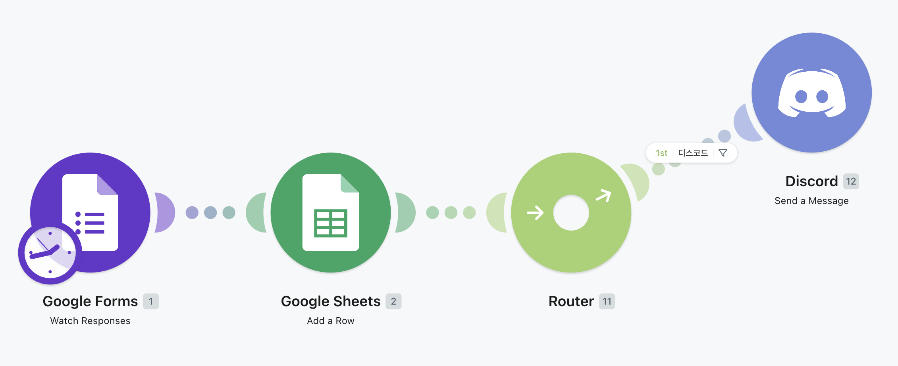
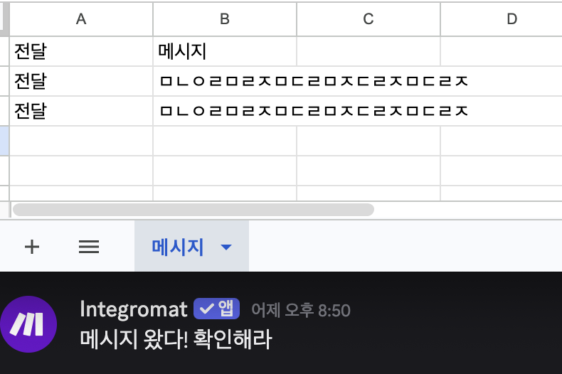

# 프로젝트 2 - 자유 주제 자동화 설계 및 구현

## 1. 자동화 업무 정의

**업무명:** 설문 응답 자동 기록 및 팀 채널 전달

**배경:**
구글 폼으로 수집된 응답을 수동으로 스프레드시트에 옮기고, 필요한 경우 팀 채널에 공유하는 반복 작업을 자동화한다.

**자동화 전 흐름:**
1. 구글 폼 응답 확인
2. 스프레드시트에 수동 기록
3. 전달 필요 시 Discord에 수동 공유

**자동화 후 흐름:**
1. 구글 폼 제출 → 자동 감지
2. 스프레드시트 자동 기록
3. 전달 여부에 따라 Discord 자동 전송

---

## 2. 도구 선정

**선정 도구:** Make (무료 플랜)

**선정 이유:**
- 무료 플랜에서 Google Forms, Google Sheets, Discord 연동 모두 지원
- Router 모듈로 조건 분기를 시각적으로 구성 가능
- 별도 API 키 없이 OAuth 인증만으로 연결 가능

---

## 3. 워크플로우 설계

### 흐름 다이어그램

```
[Trigger] Google Forms - Watch Responses
                ↓
         [Google Sheets]
          응답 내용 기록
                ↓
           [Router]
          전달 == true?
         ↙           ↘
       YES             NO
        ↓               ↓
  [Discord]          (종료)
  메시지 전송
```

> **[스크린샷 #2]** Make - 전체 시나리오 구성
>
> 


### 모듈 구성

| 순서 | 모듈 | 역할 |
|------|------|------|
| 1 | Google Forms - Watch Responses | 새 응답 감지 (Trigger) |
| 2 | Google Sheets - Add a Row | 응답 내용 기록 (Action 1) |
| 3 | Router | 전달 필드 값으로 분기 |
| 4 | Discord - Create a Message | 메시지 전송 (Action 2) |

### Router 조건

```
분기 1 (Discord 전송)
  조건: 전달 == true

분기 2 (기록만 수행)
  조건: 전달 != true  (Filter 없음, 나머지 경로)
```

---

## 4. Google Forms 구성

| 필드명 | 유형 | 설명 |
|--------|------|------|
| 전달 | 객관식 (true / false) | Discord 전송 여부 결정 |
| 메시지 | 단답형 | 전송할 내용 |

---

## 5. 실행 결과 확인 항목

| 시나리오 | 전달 값 | 예상 결과 |
|----------|---------|-----------|
| 시나리오 A | true | Sheets 기록 + Discord 전송 |
| 시나리오 B | false | Sheets 기록만 수행 |

> **[스크린샷 #3]** Make - 실행 결과
>
> 